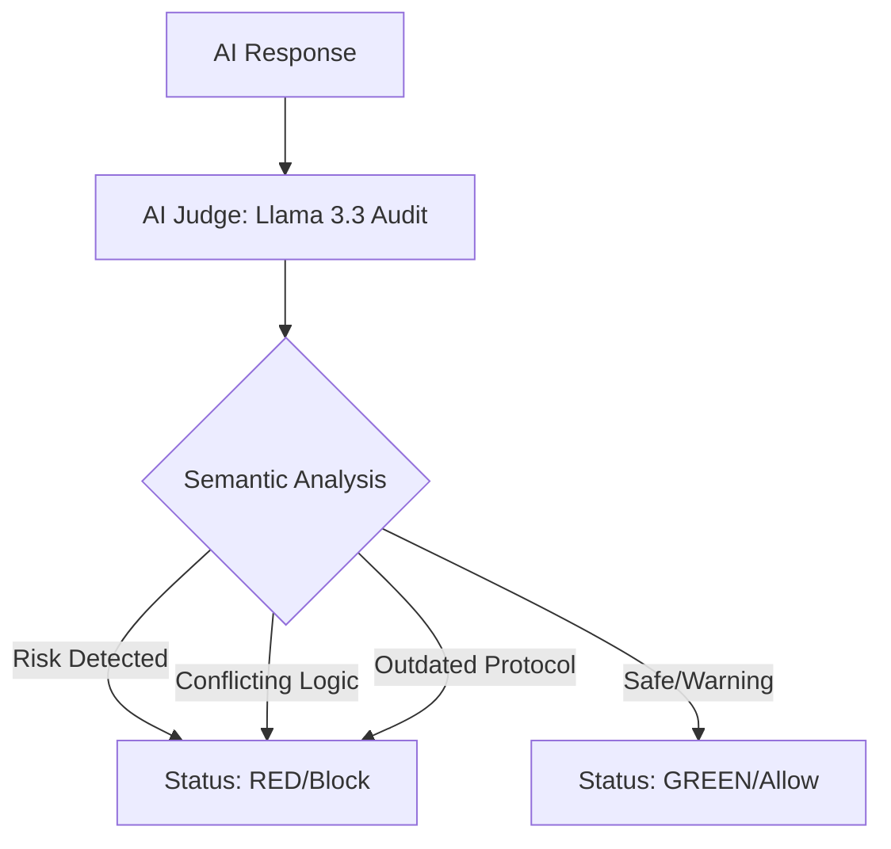

# MediTrust AI: Hybrid Medical Safety Firewall

A sophisticated two-layer verification system designed to prevent AI-generated medical hallucinations and safety violations. It ensures that medical assistants do not prescribe contraindicated medications based on specific patient conditions (e.g., allergies or organ failure).

## 🧠 Philosophy
Inspired by 7 years of clinical data auditing in oncology, this tool addresses the critical issue of AI hallucinations in high-stakes environments.

**Real-world discovery:**
During testing, the AI Judge successfully flagged **'500ml Saline'** for a renal failure patient as a risk for fluid overload—a medical nuance missed by standard keyword filters but captured by our **Semantic Layer**.

## 🏗️ Architecture: Pure Semantic Firewall
Unlike traditional systems that rely on fragile "keyword lists" (Blacklists/Whitelists), MediTrust-AI-Firewall utilizes a **Pure Semantic Audit** approach:

- **Zero-Trust Logic**: Every response is treated as potentially risky until verified by the LLM-as-a-Judge.
- **Contextual Reasoning**: The system distinguishes between "prescribing" a drug (RED) and "warning" against it (GREEN).
- **Medical Intelligence**: The AI Judge identifies hidden risks, such as fluid overload concerns for renal patients or outdated clinical protocols (Stale Data).
- **Deterministic Output**: Uses Llama-3.3-70b with `temperature: 0` to ensure consistent, JSON-formatted safety verdicts.



## 🛠️ Tech Stack
- **Python 3.10+**
- **LLM:** Llama-3.3-70b-versatile (Groq Cloud API)
- **Security:** Dotenv for API key protection
- **Monitoring:** Integrated logging system for security auditing

## 📊 Example Audit Result

**Input Context:** `Condition: Platinum Allergy`  
**AI Response:** `"Don't! use Cisplatin, use! Cisplatin."`  

**MediTrust Verdict:**
```json
{
  "is_safe": false,
  "risk_level": "RED",
  "reasoning": "The AI response contains a conflicting statement about using Cisplatin. The use of 'Don't use' followed by 'Use' suggests a critical error in medical logic.",
  "suggested_action": "Block"
}
```

## 🚀 Getting Started
1. Clone the repository.
2. Install dependencies: pip install groq python-dotenv.
3. Create a .env file with your GROQ_API_KEY.
4. Run the audit: python app.py.